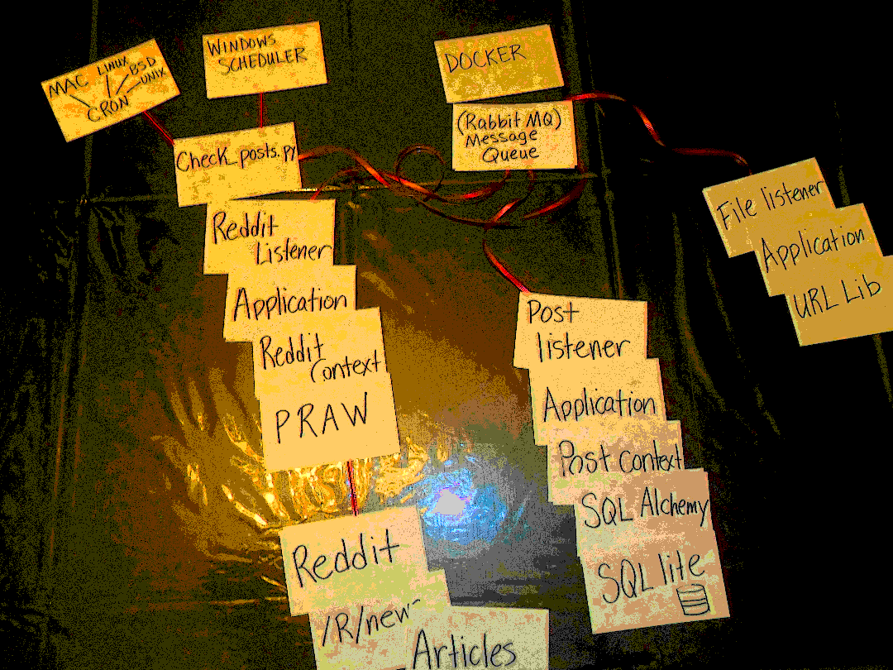

# RedditDL
Reddit Queue Based Downloader

Install dependencies

```
pip install -r requirements.txt
```

Rename example.config.yaml to config.yaml and add your information. 


Start up your RabbitMQ. _I plan on adding a docker for this, but it is trivial start one of these up._

Example:
```
 python.exe .\check_posts.py --getType "get_new" --subreddit "news" --limit 20
```

This can be scheduled if you want to pull the subreddit on a schedule.

This will start up a listener to catch the message from check_posts

```
python.exe reddit_listener.py
```

This listens the for posts from the previous command and puts them into a database.

```
python.exe post_listener.py
```

This listens to new file references and puts them into a directory.

```
python.exe file_listener.py
```

Python Requirements:

* pika
* praw
* PyYAML
* SQLAlchemy




